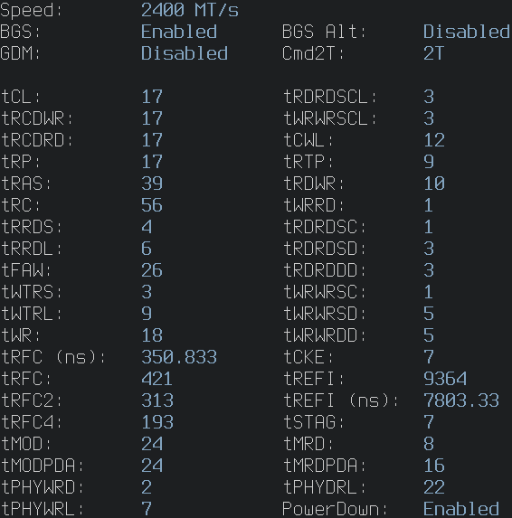

# MemTimings-Linux

Find your memory Timings of a Ryzen Zen2+ cpu under linux!

The program is currently in beta, so expect some bugs.
It requires sudo/root privilages, just like ZenTimings on windows. It is largely based on information from [amd_reg.h from CoreFreq](https://github.com/cyring/CoreFreq/blob/master/x86_64/amd_reg.h), and [zencli.c](https://github.com/cyring/Tips/blob/master/C/zencli.c).
It works by reading the contents of SMU addresses from the PCI bus.

Cyring's Github: https://github.com/cyring

Zentiming's Github: https://github.com/irusanov/ZenTimings

## To use:
* ``$ git clone https://github.com/Connor-GH/MemTimings-Linux``
* ``$ cd MemTimings-Linux/``
* ``$ gcc -o timings timings.c # add '-DDDR5=1' for DDR5``
* ``$ sudo ./timings``
