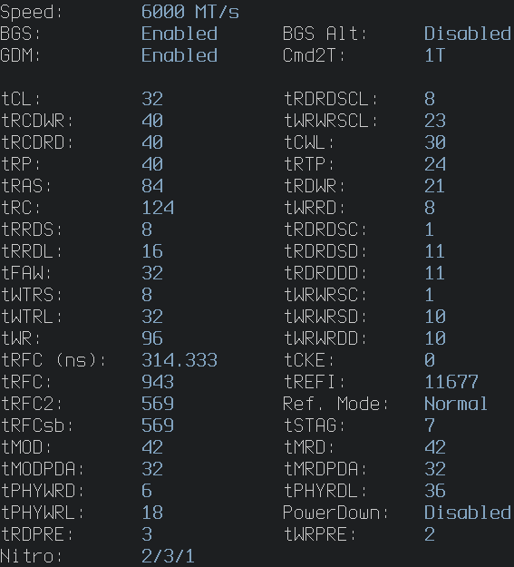

# MemTimings-Linux

## Find your memory Timings of a Ryzen cpu under linux!

The program is currently in beta, so expect some bugs.

## Known-good working:
- Zen 1 (r7 1700)
- Zen 1+ (r7 2700X)
- Zen 2 (r5 3600, r5 4650G)
- Zen 3 (r7 5700G, r7 5850U)
- Zen 4 (r9 7950X)
- Zen 5 (r9 9950X)
- Zen 5c (Krackan Point)

It requires sudo/root privileges, just like ZenTimings on windows. It is largely based on information from [amd_reg.h from CoreFreq](https://github.com/cyring/CoreFreq/blob/master/x86_64/amd_reg.h), and [zencli.c](https://github.com/cyring/Tips/blob/master/C/zencli.c). Additionally, some constants and bit interpretations were taken from ZenStates-Core, which is a part of ZenTimings.
It works by reading the contents of SMU addresses from the PCI bus.

Cyring's Github: https://github.com/cyring

Zentiming's Github: https://github.com/irusanov/ZenTimings

## To use:
* `$ git clone https://github.com/Connor-GH/MemTimings-Linux`
* `$ cd MemTimings-Linux/`
* `$ make`
* `$ sudo ./timings`
